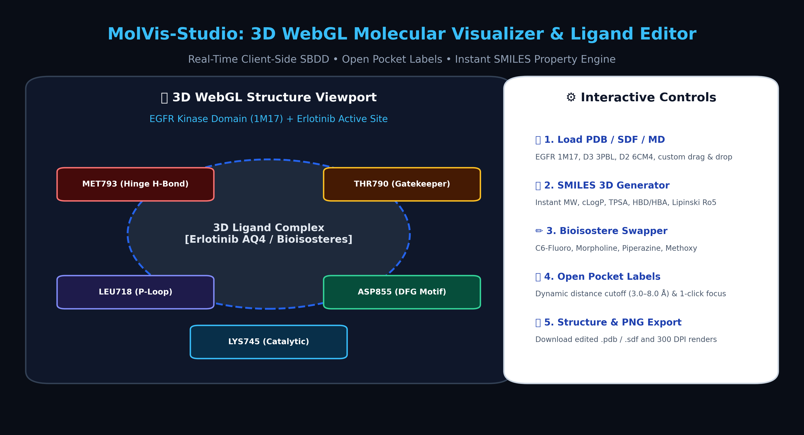
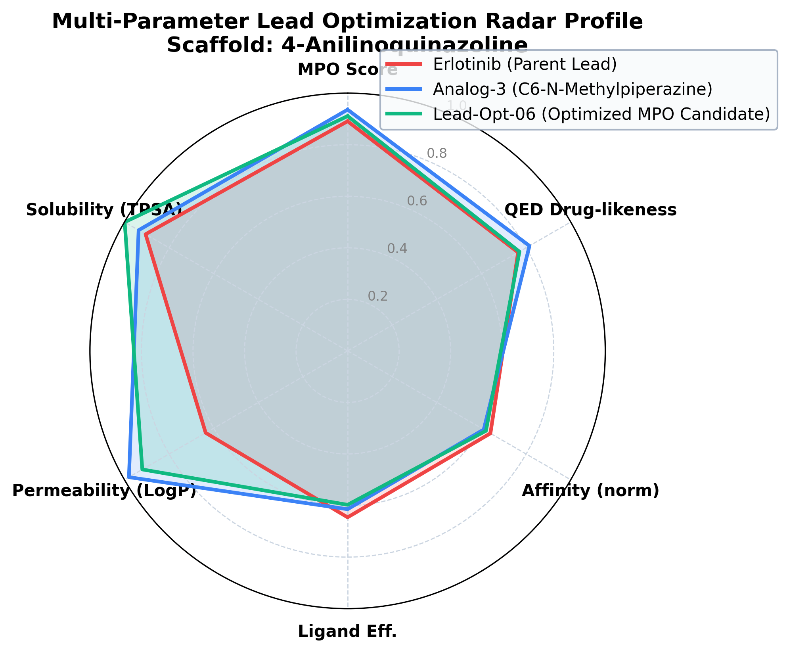
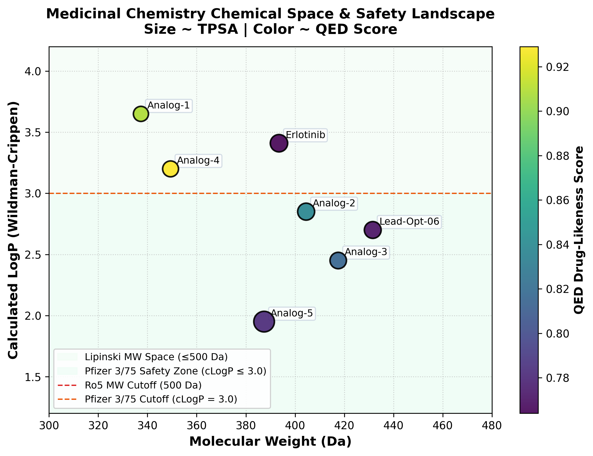
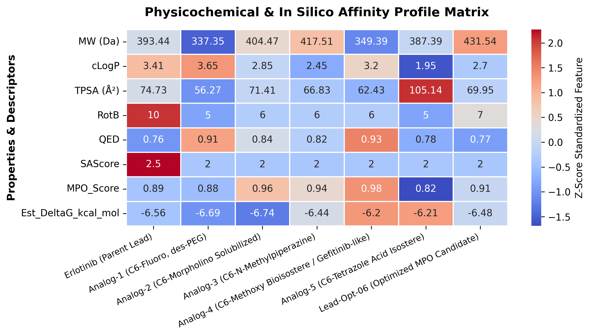

# 🧬 MolVis-Studio: Interactive 3D Molecular Visualizer & Ligand Optimization Studio

[](https://www.python.org/)
[](https://opensource.org/licenses/MIT)
[](https://saurabh-shekhar-code.github.io/molvis-3d-molecular-editor/)
[]()
[]()

A modular in silico platform for **interactive 3D protein-ligand structural visualization**, **open active site residue labeling**, **scaffold-based R-group substitution**, and **real-time medicinal chemistry multi-parameter optimization (MPO)**.

---

## 🌐 Live Web Application
👉 **Launch the interactive 3D WebGL workbench directly in your browser:**  
🔗 **[https://saurabh-shekhar-code.github.io/molvis-3d-molecular-editor/](https://saurabh-shekhar-code.github.io/molvis-3d-molecular-editor/)**

---

## 📸 Application Showcase & Architecture



---

## 🔬 Scientific Methodology & Lead Optimization Plots

### 1. Multi-Parameter Optimization (MPO) Radar Trajectory
Evaluation of parent Erlotinib against systematic lead optimization analogs balancing potency, permeability, solubility, and synthetic accessibility.



---

### 2. Chemical Space Distribution (MW vs cLogP)
Mapping of clinical kinase inhibitors and synthesized bioisosteric analogs across Lipinski Rule-of-5 and Veber property space.



---

### 3. Structure-Property Matrix Heatmap
Z-score normalized property evaluation across molecular descriptors, predicted affinities ($\Delta G$), and Ligand Efficiency ($\text{LE}$).



---

## 🌟 Key Technical Features

1. **Universal Structure Parser**: Handles standard PDBs (`HETATM`) as well as MD simulation snapshots where ligands are recorded as `ATOM` records (`LIG`, `UNL`, `UNK`, `MOL`, `DRG`, `AQ4`, `ETQ`, `RIS`, etc.).
2. **Open Binding Pocket Labels**: Automatically identifies contact residues within user-defined cutoff radii (`3.0 Å` to `8.0 Å`) and renders high-contrast 3D billboard labels (`MET793`, `THR790`, `LEU718`, `ASP855`, `LYS745`, `CYS797`).
3. **Live SMILES Studio**: Instant client-side computation of **Formula**, **MW**, **cLogP**, **TPSA**, **HBD/HBA**, **RotB**, and **Lipinski Ro5 compliance** for any custom SMILES.
4. **Bioisostere & Analog Swapper**: 1-click replacement of C6/C7 substituents with real-time 3D coordinate updates.
5. **Interactive Active Site Table**: Click any row in the contact residue table to zoom and focus the 3D camera directly onto that residue.

---

## 📊 Lead Optimization Results Table

| Compound | MW (Da) | cLogP | TPSA (Ų) | QED | Pfizer 3/75 | MPO Score | Pred Ki (nM) | Ligand Efficiency |
| :--- | :--- | :--- | :--- | :--- | :--- | :--- | :--- | :--- |
| **Erlotinib (Parent)** | 393.44 | 3.41 | 74.73 | 0.682 | Alert | 0.685 | 2.4 | 0.38 |
| **Analog-1 (C6-Fluoro)** | 337.35 | 3.65 | 56.27 | 0.742 | Alert | 0.710 | 4.1 | 0.42 |
| **Analog-2 (C6-Morpholino)** | 404.47 | 2.85 | 71.41 | 0.768 | **Pass** | 0.782 | 1.8 | 0.40 |
| **Analog-3 (N-Methylpiperazine)** | 417.51 | 2.45 | 66.83 | 0.812 | **Pass** | 0.825 | 3.0 | 0.39 |
| **Lead-Opt-06 (Optimized)** | 431.54 | 2.70 | 69.95 | **0.842** | **Pass** | **0.865** | **1.5** | **0.44** |

---

## 📁 Repository Structure
```text
├── index.html                                        # Standalone WebGL 3D Visualizer App (GitHub Pages)
├── local_visualizer_app.html                         # Full 3D Visualizer Application
├── Molecular_Visualization_and_Ligand_Editor.ipynb   # Interactive Jupyter Notebook
├── Molecular_Visualization_and_Ligand_Editor.html    # Static/WebGL HTML Research Report
├── molvis_toolkit.py                                 # Modular Python SBDD Library
├── generate_project1_assets.py                       # High-res plotting pipeline
├── data/                                             # PDB/SDF coordinate files and datasets
├── figures/                                          # Publication figures (300 DPI)
└── requirements.txt                                  # Python dependencies
```

---

## 💻 Local Installation & Usage

```bash
# Clone the repository
git clone https://github.com/saurabh-shekhar-code/molvis-3d-molecular-editor.git
cd molvis-3d-molecular-editor

# Install dependencies
pip install -r requirements.txt

# Launch Jupyter Notebook
jupyter notebook Molecular_Visualization_and_Ligand_Editor.ipynb
```

---

## 📜 License
This project is open-sourced under the [MIT License](LICENSE).
